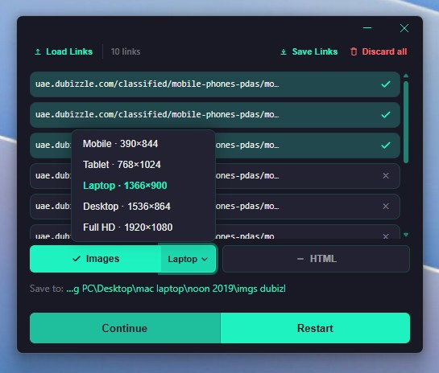

<p align="center">
  
</p>

<h1 align="center">LinkSnap</h1>

<p align="center">Full-page screenshots from a list of URLs — free and open source for Windows.</p>

LinkSnap is a free, open-source Windows app for capturing full-page screenshots from a list of URLs.

Paste or load your links, choose a mobile, tablet, laptop, or desktop viewport, and capture every page in one batch. It is useful for developers checking responsive websites, creating visual references, or archiving multiple pages without opening them one by one.

<p align="center">
  
</p>

## Features

- Capture multiple URLs as full-page PNG screenshots
- Mobile, tablet, laptop, desktop, and Full HD viewport presets
- Optionally save each page's HTML
- Load and save URL lists as text files
- Skip invalid and duplicate URLs automatically
- Track progress, cancel a batch, and continue unfinished captures
- Save to any folder and open it automatically when finished
- Use Chrome, Edge, or Playwright Chromium as the capture browser

> LinkSnap improves compatibility by retrying with different browser modes, but some websites may still block automated browsers.

## Requirements

- Windows
- [Node.js](https://nodejs.org/) 22.12 or newer, with npm
- Google Chrome or Microsoft Edge (recommended)

If Chrome or Edge is unavailable, install Playwright's Chromium:

```bash
npx playwright install chromium
```

## Run locally

```bash
git clone https://github.com/mhd-fettah/link-snapshot.git
cd link-snapshot
npm install
npm start
```

Add one `http://` or `https://` URL per line, select the output options and viewport, then click **Capture**. Files are saved to Downloads by default.

## Build for Windows

```bash
npm install
npm run build
```

Build artifacts are created in `dist/`:

- NSIS installer
- Portable executable

## Command line

The capture engine can also run without the desktop interface:

```bash
node src/capture.js urls.txt ./output
node src/capture.js urls.txt ./output --html
```

Screenshots use the format `hostname-number.png`, such as `example.com-1.png`.

## Project structure

```text
electron/   Electron main process and preload bridge
src/        URL parsing and Playwright capture engine
ui/         Desktop interface
scripts/    Windows build script
docs/       Product and technical documentation
```

## Contributing

Issues and pull requests are welcome. Keep changes focused and test the capture flow before submitting.

## License

MIT
